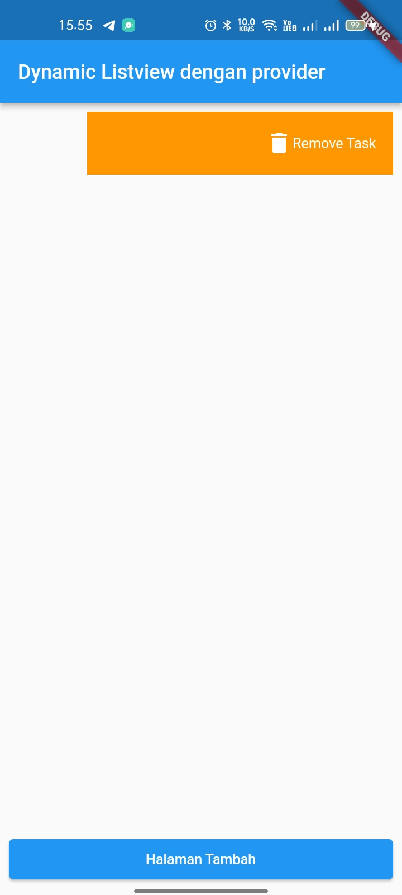

# Listview dengan Provider

Challenge untuk UTS Kerjakan salah satu saja 100 :

1. Tambahkan fitur untuk validasi input di tambah task.
  Jawab :  
2. Tambahkan fitur untuk disable button tambah task jika validasi input masih error.
  Jawab :  
3. Tambahkan fitur swipe left delete task
  Jawab :  
4. Tambahkan fitur swipe right go to edit task page
  Jawab :  
5. Tambahkan fitur edit task.
  Jawab :  
6. Tambahkan fitur validasi input di edit task.
  Jawab :  
7. Tambahkan fitur disable button edit task jika validasi input masih error.
  Jawab :  

